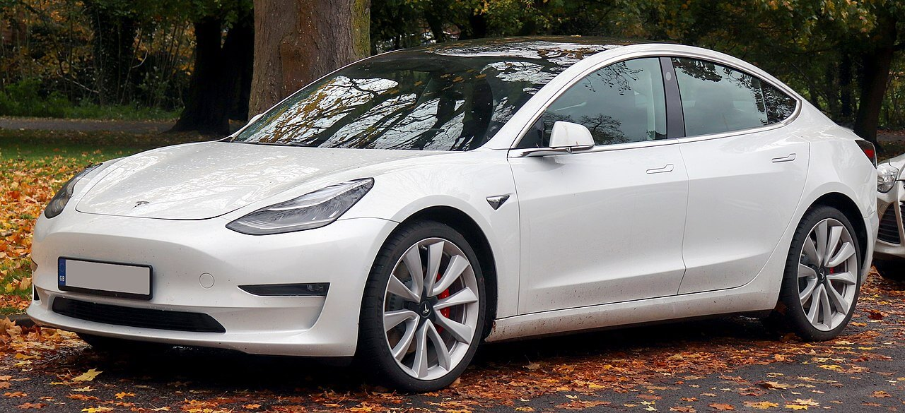

In the first half of 2021, you will see some amazing electric cars coming to India - Audi, Jaguar, and Tesla.

These powerful and sophisticated cars will change the future of electric cars forever.

On that note, Tesla is finally going to be launched in India this June, 2021 - the wait is finally over. You can clearly term 2021 as the years of electric cars.

The Union Minister of Road Transport and Highways, Nitin Gadkari confirmed that the Tesla Model 3 will be launching in the first half of 2021 then, soon after Tesla Model S and Model X will also be launched by the end of 2021 or by the beginning of 2022.

## Tesla Model 3 Specifications

| Specification    | Details                   |
|------------------|---------------------------|
| Fuel Type        | Electric                  |
| Transmission     | Automatic                 |
| Seating Capacity | 5                         |
| Doors            | 4                         |
| Body Type        | Sedan                     |
| Range            | 423 km (EPA)              |
| Battery Capacity | 54 kWh                    |
| Acceleration     | 0–97 km/h in 5.3 s        |
| Top Speed        | 225 km/h                  |
| Display          | 15.4 inch LCD touchscreen |
| Expected Price   | ₹ 60 lacs                 |

> By March 2020, Tesla Model 3 sold 500,000 units and became the world's best selling electric car. The Model 3 has full self-driving hardware with periodic software updates to improve and add extra functionality.

Now, it's time to see how well it performs in the Indian market.