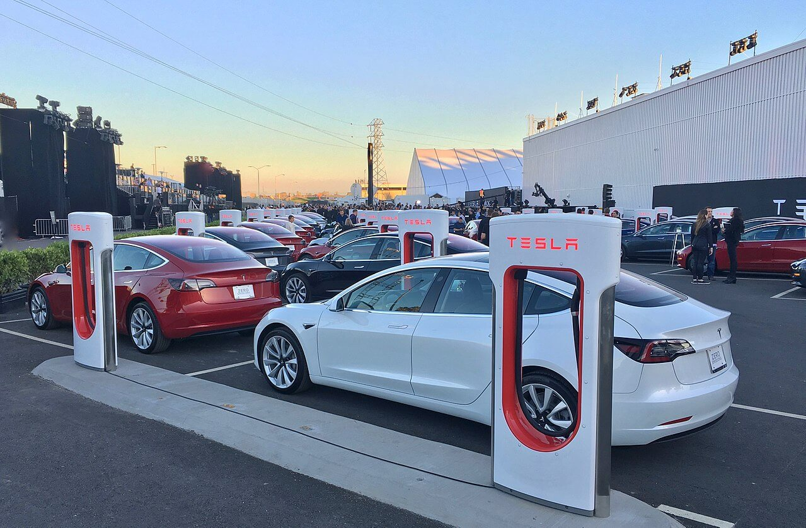

Tesla Model 3 is a 4-door self-driving electric sedan car developed by Tesla. It has full self-driving hardware with regular software updates.

Tesla Model 3 has two versions:

- Standard Range Plus version: Range - 263 miles (423 km)
- Long Range versions: Range - 353 miles (568 km)

The production of [Tesla Model 3](https://en.wikipedia.org/wiki/Tesla_Model_3) started in mid-2017 and by March 2020, it became the world’s best selling electric car. It delivered more than 500,000 units.

Talking about safety, during the crash test in 2019, the [Model 3 received 5 stars](https://electrek.co/2018/09/20/tesla-model-3-5-star-safety-rating-nhtsa/) in every category from the US National Highway Traffic Safety Administration.

## Tesla Model 3 Specifications

| Specification               | Detail                                        |
|-----------------------------|-----------------------------------------------|
| Launch Date                 | July 2017                                     |
| Manufacturer                | Tesla Inc.                                    |
| Designer                    | Franz von Holzhausen                          |
| Body style                  | 4-door fastback sedan                         |
| Layout                      | Dual-motor All-Wheel Drive (AWD)              |
| Motor type                  | Permanent Magnet Synchronous Reluctance Motor |
| Transmission                | 1-speed fixed gear                            |
| Gear ratio                  | 9:1                                           |
| Battery type                | Lithium-ion                                   |
| Battery capacity            | 54 kWh or 75 kWh                              |
| Range (Standard Range Plus) | 263 miles (423 km)                            |
| Range (Long Range versions) | 353 miles (568 km)                            |
| Wheelbase                   | 2.875 m                                       |
| Length                      | 4.694 m                                       |
| Width                       | 1.849 m                                       |
| Acceleration                | 0–97 km/h in 5.3 s                            |
| Top speed                   | 225 - 261 km/h                                |
| Full AC charge time         | 6.25 hours - Standard Range Plus              |
| Full AC charge time         | 6.5 hours - Long Range versions               |
| Rear seat                   | 60/40-split-folding rear seat                 |
| Display                     | Centre-mounted 15.4 inch LCD touchscreen      |
| Entry                       | Keyless NFC keycard                           |
| Torque response             | 10 ms                                         |
| Ultrasonic sensors          | 12                                            |
| Roof                        | All-glass                                     |
| Ultrasonic sensors          | 12                                            |
| Roof                        | All-glass                                     |

## Is the Tesla Model 3 Safe?

Yes.

Tesla Model 3 is one of the safest cars which received 5 stars in all categories from the NHTSA (National Highway Traffic Safety Administration), US.

The categories which get tested are:

- Frontal, driver
- Frontal, passenger
- Side, driver
- Side, passenger
- Side pole, driver
- Rollover

Here’s a video of the real frontal crash test of Tesla Model 3:\

<iframe width="560" height="315" src="https://www.youtube.com/embed/tnpE55qmTSM" frameborder="0" allow="accelerometer; autoplay; clipboard-write; encrypted-media; gyroscope; picture-in-picture" allowfullscreen></iframe>

## Complaints with the Tesla Model 3

In May 2018, Consumer Reports branded the Model 3 as “not recommended” as it’s stopping distance during an emergency was worse than a Ford F-150 full-size truck. Tesla acknowledged the faults and released an [OTA update](https://www.wired.com/story/tesla-model3-braking-software-update-consumer-reports/) for the anti-lock braking algorithm. Later, Consumer Reports changed their rating to a “recommended model”.

In Feb 2019, Consumer Reports again marked it “not recommended” as many customers reported to have problems like loose body trim and glass defects. Tesla reduced these flaws over time and later Consumer Reports marked it as a “recommended model”, again.

In 2020, Tesla used the 2.5 version processors because due to coronavirus outbreak the Shanghai factory was closed. After mass complaints, Tesla promised to upgrade everyone to 3.0 processor for free once the supply chain is restored.

That’s it.

Tesla Model 3 is also going to be launched for the very first time in India in mid-2021. Let’s see how everything goes.