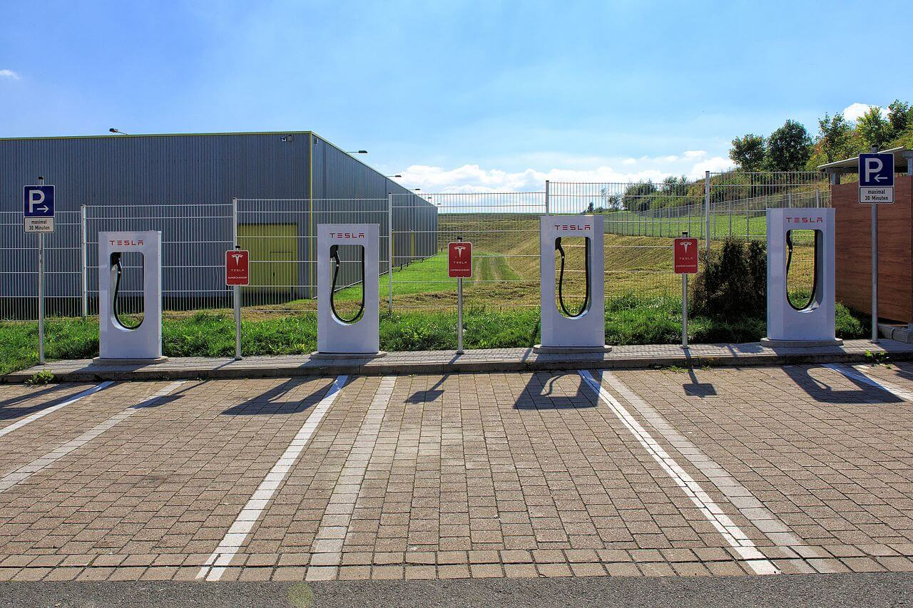
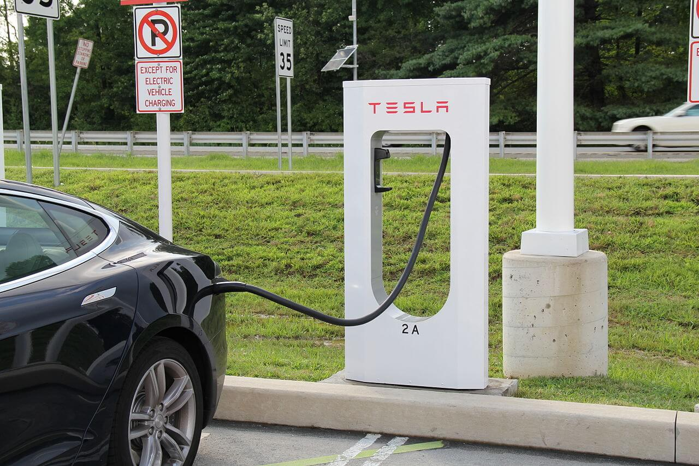
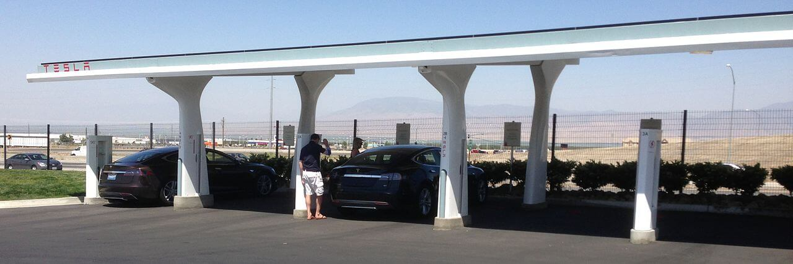
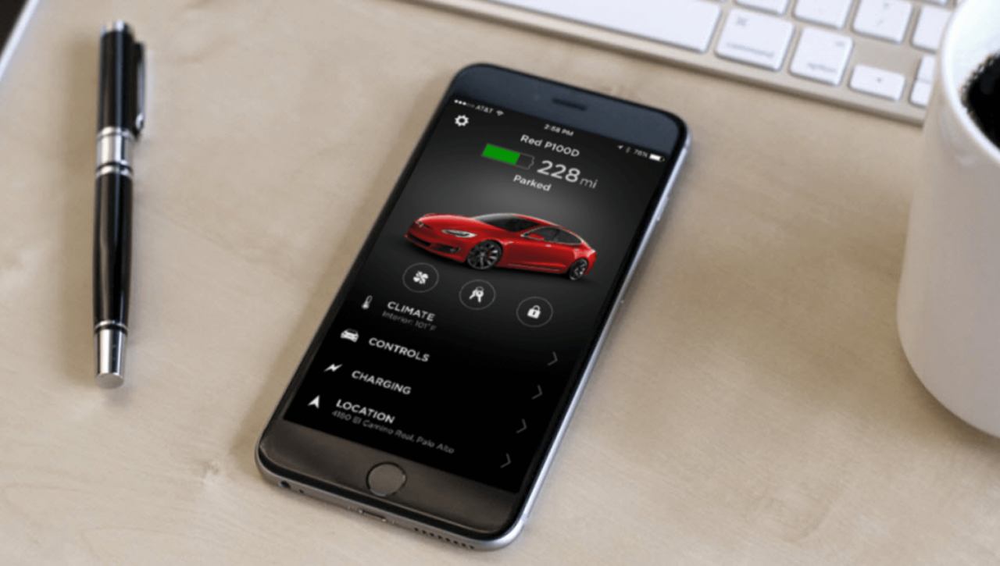

As the name suggests, Tesla Supercharger is a fast charging technology for Tesla electric cars. It’s much like a gas/petrol station for electric cars.

As of Nov 8, 2020, there were 20,000 Superchargers worldwide (Multiple countries in Asia, North America, Europe, and the Middle East) and it’s still expanding. And, considering the fact the Supercharger network first got introduced in 2012, it’s a very fast growth rate.

[Tesla Superchargers](https://en.wikipedia.org/wiki/Tesla_Supercharger) use 480-volt Direct Current (DC) to charge their electric cars. When travelling a long distance, you can plug-in your Tesla car to the Supercharger and have it charged. These can provide the electric power at maximums of 72 kW, 150 kW, or 250 kW which is enough to charge your car within minutes.

To charge the [Model S](https://enrzi.in/2-tesla-model-3-specs/) (85 kWh), it takes approx. 20 mins to charge up to 50%, 40 mins to 80% and 75 mins to 100%.

## Are Superchargers Free?

Model S and Model X cars that were ordered before Jan 15, 2017 have unlimited supercharging for life, for free. And, some other cars that were ordered between Aug 2, 2019 and May 26, 2020 will also receive free lifetime charging.

Also, some models receive some free charging credits per year.

**So, what will be the cost to charge your car?**

It’s needless to say that the charging fee is considerably lower than filling up a gas/petrol-powered car.

Here’s a table that explains everything:

| Models  | 500 miles | 1000 miles |
|---------|-----------|------------|
| Model S | $41       | $81        |
| Model X | $49       | $98        |
| Model 3 | $34       | $67        |

Please note that these are approximate costs and can vary as per different countries and different regions.

## Tesla Mobile App

Tesla also has a mobile app which notifies you when your vehicle is ready to go to the [Supercharging station](https://www.tesla.com/supercharger). You can put your Tesla car on the charge, grab a cup of coffee, have some snacks and when the car is ready, the app notifies.

Also, if your vehicle is connected even after the charging is complete then you will have to pay either $1 per minute (if the Supercharger is at 100%) or $0.50 per minute (if the Supercharger is at least 50% full).

## Final Words

Currently, Superchargers are only being used to charge Tesla cars but on multiple occasions, they have indicated that other electric cars might also be able to use Superchargers in the near future.