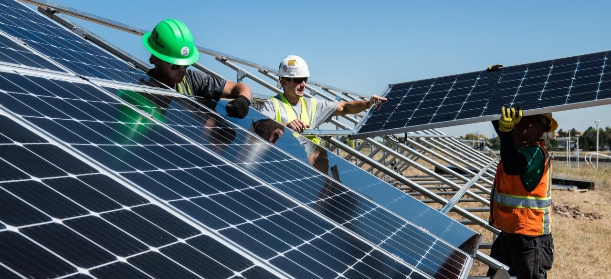
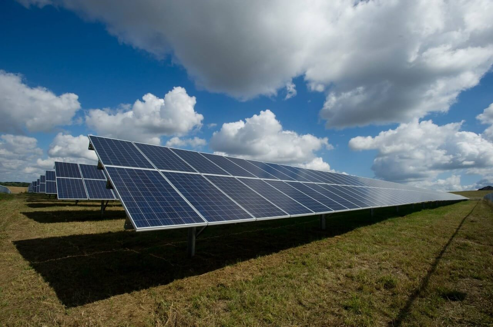

Mainly, the solar panels can be divided into 3 categories:

- Monocrystalline solar panels
- Polycrystalline solar panels
- Thin-Film solar panels

Each solar panel has different qualities and efficiencies.

Monocrystalline is considered to be the highly efficient, Polycrystalline as moderately efficient and Thin-Film as least efficient. But each has their own pros and cons.

Let's understand each of them:

| Monocrystalline                                    | Polycrystalline                                  | Thin-Film                                               |
|----------------------------------------------------|--------------------------------------------------|---------------------------------------------------------|
| 21% max efficiency                                 | 16% max efficiency                               | 12% max efficiency                                      |
| Black colored                                      | Blue colored                                     | Black or Blue colored                                   |
| -0.3%/C to -0.5%/C Temperature Coefficient         | -0.3%/C to -0.5%/C Temperature Coefficient       | -0.2%/C Temperature Coefficient                         |
| Made from Single crystal of Silicon                | Made from Multiple crystals of Silicon           | Made from Amorphous Silicon                             |
| 25-30 years of life span                           | 20-25 years of life span                         | 15-20 years of life span                                |
| Best performance at standard temperature           | Best performance at moderately high temperature  | Best performance at high temperature                    |
| Requires least area for a given power              | Requires less area for a given power             | Require large area for a given power                    |
| Performance decreases in low-sunlight conditions   | Performance decreases in low-sunlight conditions | Performance is less affected by low-sunlight conditions |
| Large amount of Silicon means high embodied energy | Large amount Silicon means high embodied energy  | Small amount Silicon means low embodied energy          |

## 1. Monocrystalline solar panel

Monocrystalline solar panels have cells cut from a single Silicon crystal. Since each cells are made from a single piece of Silicon, these are considered as the purest form of solar panels.

And, since they are in the purest form, they are more likely to produce the rated output in the less ideal conditions (low-sunlight).

However, they are more costly to have.

## 2. Polycrystalline solar panel

Polycrystalline solar panels are made from multiple pieces of Silicon blended together. To create a solar cell, similar bits of pieces of Silicons are molded together.

This process of making solar cell doesn’t create any wasteful material because all pieces of Silicon is used for making the next cells.

Because of the imperfect and uneven surfaces, these solar panels are slightly less efficient than Mono panels.

However they are cheaper than the Monocrystalline panels.

## 3. Thin-film solar panel

Thin-film solar panels are created by depositing a thin layer of conductive material onto a backing plate made of glass or plastic.

However these are not used in domestic solar installation. This type of solar panels are mainly used in large-scale utility projects and some specialty applications.

The majority of solar panels installed today are either Monocrystalline or Polycrystalline type.

---

Source: [1](https://unboundsolar.com/blog/monocrystalline-vs-polycrystalline-solar-panels), [2](https://www.energysage.com/solar/101/types-solar-panels/), [3](https://www.exsolar.co.za/mono-vs-poly-vs-thin-film-panels.html)